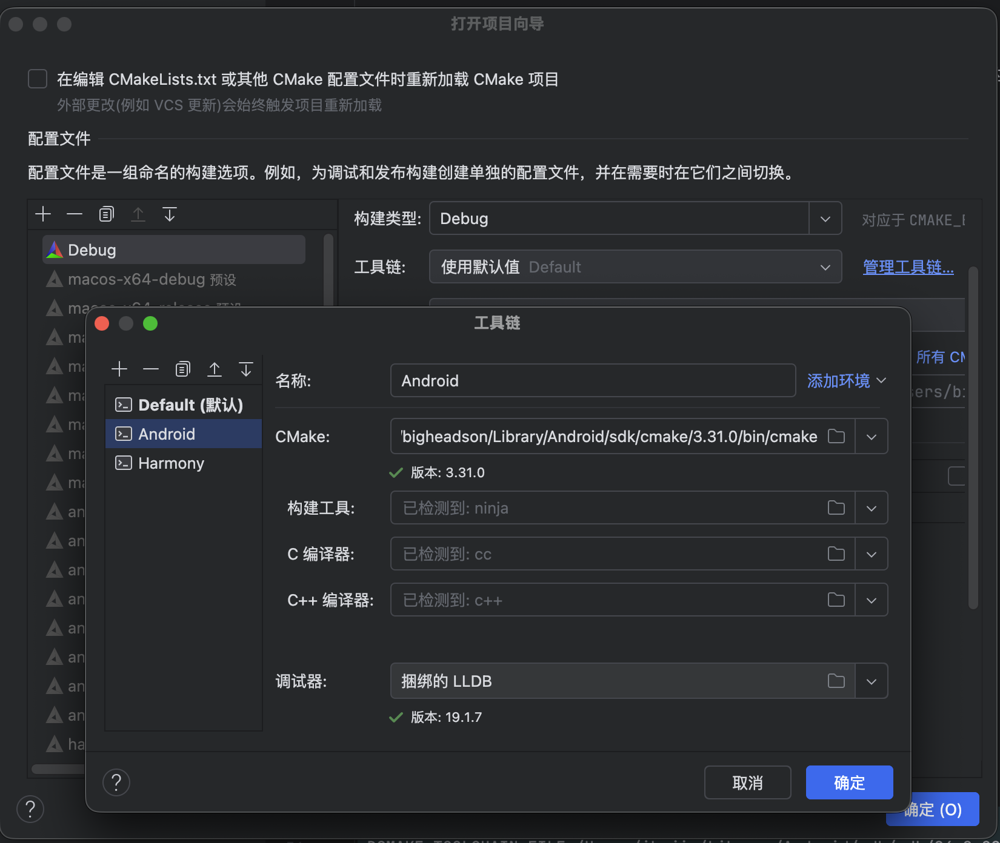
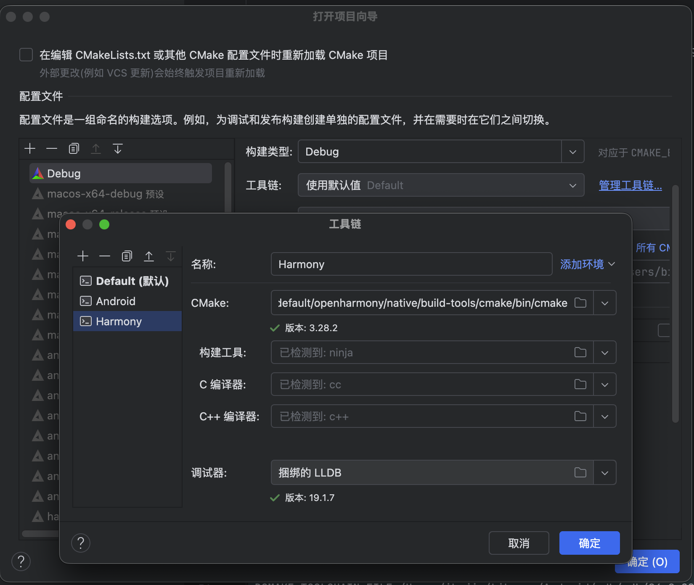
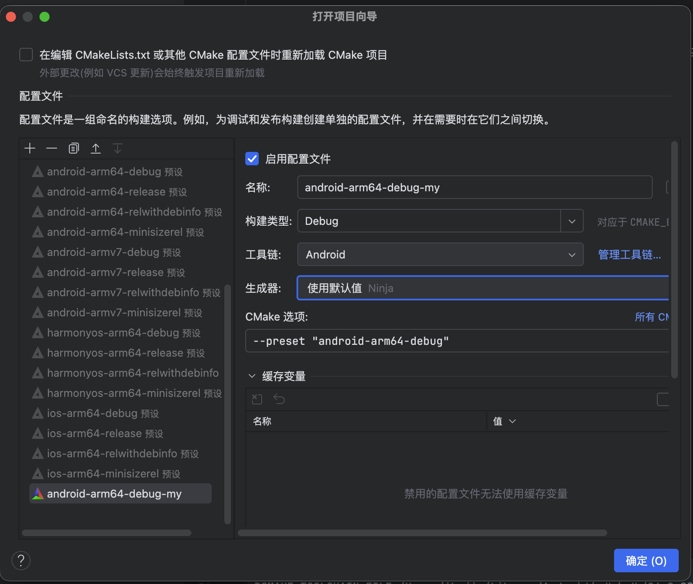
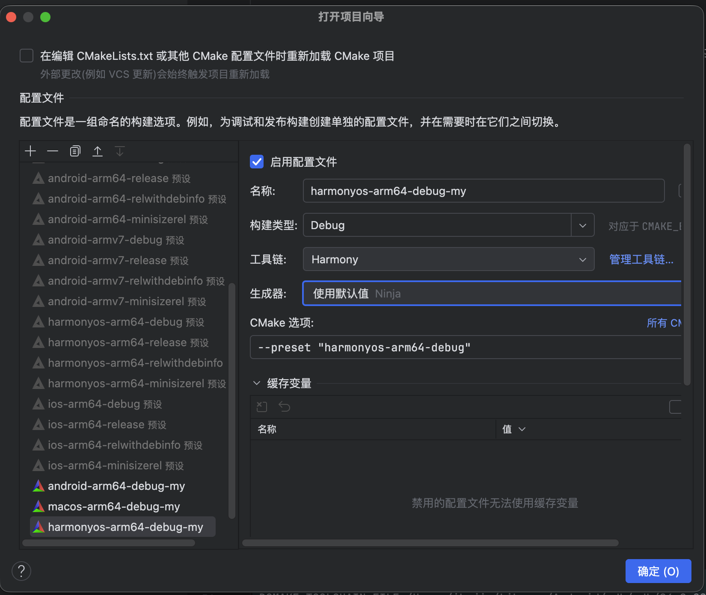

# 跨平台 C++ 项目模板

## 项目结构

```text
main/
|-- cmake/
|-- platforms/
    |-- macos/
        |-- include/
        |-- libs/
        |-- src/
        |-- platform.cmake
    |-- android/
    |-- windows/
    |-- linux/
    |-- ios/
    |-- harmony/
|-- public/
    |-- include/
    |-- libs/
    |-- src/
    |-- public.cmake
samples/
CMakeLists.txt
CMakePresets.json
```

## 项目配置

本项目使用 `CLion` 作为开发工具, `CMake` 作为构建工具.
首先先配置 `CMake` 工具链，分别配置 `HarmonyOS` 和 `Android` 的 `CMake` 工具链。
最开始打开项目时，IDE会读取 `CMakePresets.json`, 你会看到 `profile` 中有很多的预设，
我们只需要复制其中我们想要的预设，然后选择正确的 `toolchain` 最后启用就可以,
如果没有配置 `toolchain`, 则需要先配置 `toolchain`




再配置 profile。

### Android

安卓的 `profile` 默认使用 `ndk 27.3.13750724`, `target api` 为 24,
如果想要修改可以在 `CMakePresets.json` 中修改

```
    {
      "name": "target-android",
      "displayName": "target-android",
      "hidden": true,
      "environment": {
        "ANDROID_NDK_HOME": "$env{ANDROID_HOME}/ndk/27.3.13750724"
      },
      "cacheVariables": {
        "CMAKE_TOOLCHAIN_FILE": "$env{ANDROID_NDK_HOME}/build/cmake/android.toolchain.cmake",
        "ANDROID_TOOLCHAIN": "clang",
        "ANDROID_PLATFORM": "android-24",
        "ANDROID_STL": "c++_shared",
        "ANDROID_ARM_NEON": {
          "type": "BOOL",
          "value": "ON"
        }
      }
    },
```

#### Harmony



## 其他工程如何使用

安装后的目录结构为
```text
install/
|-- cmake/
|-- include/
|-- libs/
|-- z-functions.cmake
|-- z-import.cmake
```

### 导入库

在其他工程中使用 `cpp_template` 库时，需要先导入库。
可以在 `CMakeLists.txt` 中添加以下代码：

```cmake
include(path/to/z-import.cmake)
z_import_my_package(cpp_template)
```

### 链接库

在其他工程中使用 `cpp_template` 库时，需要链接库。
可以在 `CMakeLists.txt` 中添加以下代码：

```cmake
target_link_libraries(your_target cpp_template)
```


